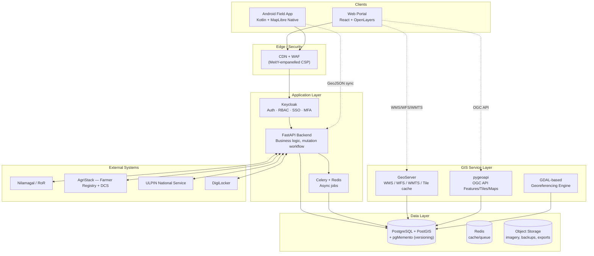

# Implementation Plan — WebGIS Platform (Module 2) & Mobile/Georeferencing (Module 3)
**RFP No: M-13/1237/2025 — Govt. of Puducherry, DoSLR**
**Scope covered:** Module 2 + Module 3 only. Module 1 (FMB reconstruction/data prep) is excluded — this plan assumes the reconstructed cadastral layer lands in PostGIS as input.

---

## 1. The core idea

The RFP mandates a **fully open-source stack**, and the timeline is brutal: Module 2 has to be built in **3 months** (month 1–4) and Module 3 in **2 months** (month 3–5), running in parallel. There is no time to hand-roll a map editor, an auth system, a tile server, or a georeferencing math library.

The good news: every single hard requirement in this RFP — OGC services, role-based access, versioned audit logs, polygon editing, GCP-based rubber-sheeting, vector tiles — already has a **mature, battle-tested open-source project** that does it. The job is integration and configuration, not invention. Section 8 below is a single table mapping every RFP requirement to the exact tool that already does it.

---

## 2. Architecture at a glance

**Why this shape:** GeoServer handles the legacy OGC standards (WMS 1.3.0/WFS 2.0/WMTS) that older clients and tile caching need. pygeoapi handles the newer OGC API – Features/Tiles/Maps standard the RFP explicitly names. Both read the same PostGIS database, so you don't duplicate data — you just stand up two well-known servers in front of it.

---

## 3. Recommended tech stack

| Layer | Tool | License | Why this one |
|---|---|---|---|
| Spatial database | **PostgreSQL + PostGIS** | Open source | RFP names it directly as the expected choice |
| Versioning / audit trail | **pgMemento** (PostGIS extension) | Open source | Automatic history tables, point-in-time queries, rollback — built for exactly "queryable as of any date" |
| OGC map/feature services | **GeoServer** | GPL (server-side, doesn't affect your code) | Mature WMS/WFS-T/WMTS, GeoWebCache for tile caching, mapfish-print for PDF export |
| OGC API services | **pygeoapi** | MIT | Native OGC API – Features/Tiles/Maps/Styles + STAC 1.0 support |
| Backend application/API | **FastAPI** (Python) | MIT | Auto-generates OpenAPI 3.x docs — literally a deliverable requirement — plus async support |
| Spatial ORM | **GeoAlchemy2 + Shapely** | MIT/BSD | PostGIS object mapping, geometry ops, no raw SQL geometry handling |
| Background jobs | **Celery + Redis** | BSD | Mutation sync, bulk CSV ingestion, georeferencing batch jobs |
| Identity/Auth | **Keycloak** | Apache 2.0 | RBAC, SSO, MFA, DigiLocker/OTP federation — all built in |
| Web map client | **OpenLayers** | BSD | The only OSS map library with production-grade editing interactions (Modify/Draw/Snap/Translate) AND full WMS/WFS/WMTS/vector-tile support |
| Geometry ops (browser) | **Turf.js** | MIT | Polygon split, union (amalgamation), area/perimeter, buffering |
| Georeferencing engine | **GDAL/OGR** | MIT/X | Native affine, polynomial, and thin-plate-spline (TPS) GCP transforms for both raster and vector — exactly the 4 transform types the RFP lists |
| Mobile map SDK | **MapLibre Native (Android)** | BSD-2 | Open-source fork of Mapbox GL — vector + raster tiles, offline packs |
| Mobile language | **Kotlin** (native) | Apache 2.0 | Direct, reliable access to Bluetooth/NTRIP/GNSS APIs — not worth the risk of a cross-platform plugin layer for this |
| Local mobile storage/sync | **Room + WorkManager** (Jetpack) | Apache 2.0 | Standard offline-first sync pattern, retry/backoff for free |
| PDF/cartographic export | **mapfish-print** (GeoServer module) | GPL | Title block, legend, scale bar PDF export out of the box |
| Excel export | **openpyxl** | MIT | Anomaly/variance report exports |
| Search/audit logs | **OpenSearch** | Apache 2.0 | Searchable query/export logs, dashboards for officials |
| Monitoring | **Prometheus + Grafana** | Apache 2.0 | p95 latency tracking against the 2s SLA |
| Load testing | **k6** or **Locust** | AGPL/MIT | Pre-Go-Live validation of 1,000 concurrent users target |
| Containers/portability | **Docker + Kubernetes (k3s)** | Apache 2.0 | OCI-compliant — satisfies "no CSP lock-in" requirement directly |
| Infra as code | **Terraform** | MPL 2.0 | Repeatable deployment, needed for the 90-day SDC migration commitment |
| CI/CD | **GitHub Actions / GitLab CI** | — | Automated build/test/deploy |

**One compliance flag:** Do not reach for Mapbox GL JS — versions after v1 are under a non-open-source license (BSL), which would directly violate the RFP's "fully open-source technology stack" clause. MapLibre GL (web) and MapLibre Native (Android) are the correct drop-in replacements and are what this plan uses throughout.

---

## 4. Module 2 — WebGIS Platform, feature by feature

### 4.1 Data Visualisation (Sec 18.3.1)
- Orthomosaic as WMTS/XYZ tiles → **GeoServer + GeoWebCache**, pre-cached, fronted by CDN to hit the 300ms p95 tile target.
- Parcel/FMB/admin boundary layers → published from PostGIS via GeoServer (WMS/WFS) **and** pygeoapi (OGC API – Features), both reading the same tables.
- Base map switching, opacity control, scale-dependent symbology → **OpenLayers** native layer/style API — no custom rendering engine needed.
- Don't build a tile cache from scratch — GeoWebCache + CDN solves the performance SLA directly.

### 4.2 Core Functionalities (Sec 18.3.2)
- Parcel search (Survey No., ULPIN, owner name with auth gating) → FastAPI endpoint over PostGIS, indexed columns; owner-name queries logged to OpenSearch automatically via middleware.
- Measurement tools (distance/area/bearing/buffer) → **OpenLayers** built-in `ol/interaction` + **Turf.js** for geodesic calculations. Don't write your own geometry math.
- Spatial queries (point-in-parcel, within-distance, intersects) → native **PostGIS** functions (`ST_Within`, `ST_DWithin`, `ST_Intersects`) exposed through simple FastAPI endpoints.
- PDF/CSV/Shapefile/GeoJSON export → **mapfish-print** for cartographic PDF; GDAL/OGR `ogr2ogr` for format conversion (Shapefile/GeoPackage/GeoJSON) — both off-the-shelf, no custom exporters.

### 4.3 Editing Tools (Sec 18.3.3)
- Vertex add/move/delete, snapping → **OpenLayers** `Modify` + `Snap` interactions, configurable tolerance.
- Parcel split (draw a line) / amalgamation (select + merge) → **Turf.js** `lineSplit` / `union`, run client-side for preview, committed server-side for the authoritative edit.
- Rubber-sheeting preview → **GDAL** GCP transform run server-side as a dry-run, result streamed back for the live preview before commit.
- Versioning, rollback, immutable audit log, 7-year retention → **pgMemento**. This is the single highest-leverage tool in this whole plan — it gives you point-in-time queries and full audit history without writing a single trigger by hand.

### 4.4 Revenue Data Integration / Online Mutation (Sec 18.3.4)
- Bidirectional sync with Nilamagal/Collabland → FastAPI integration service consuming their APIs/CDC feed; **Celery** handles the async sync jobs and retries.
- Approval-before-sync workflow → a simple state machine (Draft → Submitted → Approved → Synced → Rejected) using the Python **`transitions`** library — lightweight, no need for a full BPMN engine like Camunda unless the approval logic grows multi-step later.

### 4.5 AgriStack Integration (Sec 18.3.5)
- Farmer Registry + DCS API integration → FastAPI service layer, consent/DPDP-Act handling via tokenised references (no PII stored beyond what's required).
- Reverse publish to AgriStack → same integration service, scheduled via Celery.

### 4.6 ULPIN / Bhu-Aadhaar (Sec 18.3.6)
- Generation, lifecycle (split/merge → retire/issue), lookup API → custom logic in FastAPI (this part genuinely is bespoke — there's no open-source ULPIN library — but it's a thin layer on top of pgMemento's lineage tracking, not built from zero).

### 4.7 User Access and Roles (Sec 18.3.7)
- Every role class (Public Citizen → Administrator) → **Keycloak realm roles + groups**, enforced both at the API gateway and in FastAPI route guards.
- DigiLocker login → Keycloak custom Identity Provider (OIDC broker) pointed at DigiLocker's OAuth endpoints.
- OTP login for citizens → Keycloak SMS-OTP extension + any SMS gateway.
- MFA for privileged roles → Keycloak's built-in TOTP/WebAuthn, just toggled on for the relevant roles.
- **Don't build a login system.** This is the second-highest-leverage tool choice after pgMemento.

### 4.8 Discrepancy & Anomaly Analytics (Sec 18.3.8)
- Area variance bands (Green/Amber/Red), boundary mismatch detection → PostGIS spatial comparison queries (`ST_Area`, `ST_HausdorffDistance` or `ST_Difference` between cadastral vector and orthomosaic-derived edges), styled in OpenLayers with conditional symbology.
- Record-map mismatch dashboard → a FastAPI aggregation endpoint + a React dashboard (Ant Design table/chart components — don't build a charting library, use **Recharts** or Ant Design Charts).
- Exportable reports → same mapfish-print/openpyxl pipeline as 4.2.

---

## 5. Module 3 — Mobile App & Automated Georeferencing

### 5.1 Android Application (Sec 18.4.1)
- Map view (cadastral + orthomosaic + admin boundaries) → **MapLibre Native Android SDK**, vector + raster tile support, offline tile packs for patchy field connectivity.
- Parcel search, read-only attribute display → simple REST calls to the same FastAPI backend used by the web app — **one backend serves both clients**, no duplicate API.
- DGPS/GNSS point ingestion (Bluetooth/NTRIP/file import) → don't write an NTRIP/RTCM parser from scratch. Adapt an existing open-source NTRIP client implementation (the BKG NTRIP client reference code is public-domain and widely ported) for the Bluetooth/network layer; Android's native Bluetooth APIs handle device pairing.
- Offline-first sync → **Room** (local DB) + **WorkManager** (background sync with automatic retry/backoff) — standard Android Jetpack pattern, not custom-built.
- Security: on-device encryption, role auth, time-limited tokens → Android's **EncryptedSharedPreferences/Jetpack Security** + Keycloak-issued short-lived JWTs.

### 5.2 Web-Based Point Ingestion & Visual Georeferencing Workbench (Sec 18.4.2)
- This lives **inside the same React/OpenLayers web app** as Module 2 — it's a specialized page, not a separate platform.
- CSV/Excel upload with validation → **Pandas** (server-side validation) + a simple upload component.
- Manual coordinate entry, drag-and-link pairing → OpenLayers `Draw`/`Modify` interactions, nothing custom.
- Live rubber-sheet preview with RMSE readout → **GDAL** GCP transform (dry-run) — GDAL computes per-GCP residuals automatically, so the RMSE number is a direct read from GDAL's output, not something you calculate yourself.

### 5.3 Automated Georeferencing Engine (Sec 18.4.3)
- This is the most "bespoke" piece of the whole project, but even here, the math is not yours to write:
  - **Affine / polynomial (order 1–3) / thin-plate-spline transforms** → `gdal.Warp` / `gdal_translate -gcp ... -tps` natively supports all four transform types named in the RFP. This single GDAL capability covers the entire transformation-type requirement.
  - **Weight-based merging** (DGPS=1.0 > orthomosaic=0.7 > legacy=0.3) → this part genuinely is custom business logic (weighting which GCP source wins), built as a thin orchestration layer that feeds weighted points into GDAL's transform call.
  - **Dry-run + explainability log** → wrap the GDAL call, log inputs/transform/RMSE/before-after geometry to the same pgMemento-backed audit trail used everywhere else — one audit system for the whole platform, not a separate one for this engine.

---

## 6. Cross-cutting requirements (Sec 18.6)

| Requirement | How it's met |
|---|---|
| Scalability (1,000 concurrent auth users, 500 anon) | Kubernetes (k3s) horizontal pod autoscaling on FastAPI/GeoServer; GeoWebCache + CDN absorb tile load |
| OGC compliance (WMS/WFS/WMTS/OGC API/STAC) | GeoServer (legacy standards) + pygeoapi (OGC API + STAC) — both required, both already exist as projects |
| OGC CITE validation before Go-Live | Run the official OGC CITE test suite against GeoServer/pygeoapi endpoints — it's a free conformance tool, not something to build |
| Cloud hosting, MeitY-empanelled CSP | Procurement/compliance decision, not a tech one — confirm with DoSLR which empanelled CSP to target before infra work starts |
| Data residency (India only) | CSP region selection + Terraform-enforced region locks |
| DR (RPO ≤15min, RTO ≤60min) | PostgreSQL streaming replication + WAL shipping to a second Indian region; Kubernetes manifests redeployed via Terraform in DR drills |
| Cloud portability (no CSP lock-in) | Everything containerized (Docker/K8s) and using OSS components only — this is a natural consequence of the stack chosen above, not extra work |

---

## 7. Suggested build sequence (mapped to the RFP's own milestone table)

| Window | Focus | Key deliverable |
|---|---|---|
| Month 0–0.5 | SRS, architecture doc, project plan | Signed SRS/Architecture (RFP milestone 1) |
| Month 1 | Environment setup: PostGIS, GeoServer, pygeoapi, Keycloak, FastAPI skeleton, OpenLayers shell, CI/CD pipeline live | Base map services online as soon as Module 1 data starts landing |
| Month 1–2 | Data Visualisation + Core Functionalities (search, measure, spatial query, export) | Working read-only portal |
| Month 2–3 | Editing tools + pgMemento versioning + Keycloak RBAC roles | Editable, audited, role-gated portal |
| Month 3 | Revenue/Nilamagal integration + ULPIN service | Bidirectional sync live |
| Month 3–4 | AgriStack integration + Discrepancy/Anomaly Analytics | Module 2 feature-complete |
| Month 4 | Module 2 UAT, deploy to pre-production | UAT sign-off (RFP milestone 3) |
| Month 3–5 (parallel) | Android app build (Kotlin + MapLibre Native), web georeferencing workbench, GDAL engine service | Field + web georeferencing integration report (RFP milestone 4) |
| Month 4–5 | Cross-module integration testing, ULPIN/Farmer Registry/DCS cutover | Integration test reports (RFP milestone 5) |
| Month 5–6 | OGC CITE validation, load testing (k6/Locust), documentation, final acceptance | System acceptance test report, handover (RFP milestone 6) |

Running Module 3 in parallel from month 3 (not waiting for Module 2 to finish) is what makes the 5-month build window realistic — it only works because both modules share the same backend, auth, and audit infrastructure built in months 1–2.

---

## 8. Consolidated "don't build this" reference table

| You might be tempted to build... | Use this instead |
|---|---|
| A custom map tile server | GeoServer + GeoWebCache |
| A custom OGC API implementation | pygeoapi |
| A login/RBAC/SSO system | Keycloak |
| A version-history/audit-log system | pgMemento |
| A polygon editor (vertex edit, snap) | OpenLayers interactions |
| Polygon split/merge math | Turf.js |
| Georeferencing transform math (affine/poly/TPS) | GDAL/OGR GCP warp |
| RMSE calculation | GDAL's built-in residual output |
| PDF map export with legend/title block | mapfish-print |
| Format conversion (Shapefile/GeoPackage/GeoJSON) | GDAL/OGR `ogr2ogr` |
| Offline mobile sync engine | Room + WorkManager |
| NTRIP/RTCM parsing | Adapted from existing open NTRIP client code |
| Approval workflow state machine | Python `transitions` library |
| Audit log search/dashboard | OpenSearch |
| Load testing harness | k6 / Locust |

---

## 9. Key risks to flag early

1. **MeitY-empanelled CSP isn't chosen yet** — this blocks infra-as-code work; confirm with DoSLR in week 1.
2. **DigiLocker OIDC integration details** — Keycloak supports it, but DigiLocker's onboarding/approval process can take time; start that application immediately, don't wait for month 3.
3. **AgriStack/DCS API access** — same story; these are external government systems with their own onboarding lead time, independent of your build speed.
4. **NTRIP/Bluetooth GNSS device compatibility** — test against the actual DGPS/GNSS rover hardware DoSLR's survey partner will use, as early as possible; this is the one piece of Module 3 that can't be fully de-risked by library choice alone.
5. **8-week max delay per milestone** before termination risk kicks in — the parallel-track plan in Section 7 exists specifically to protect against this.
